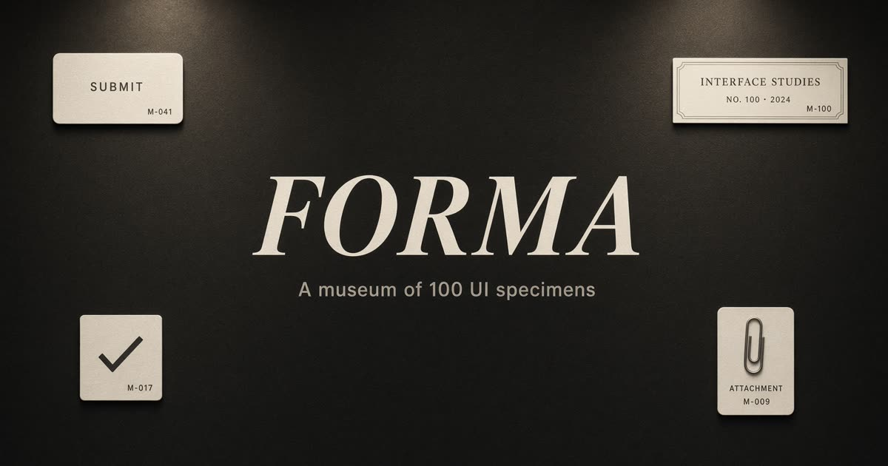
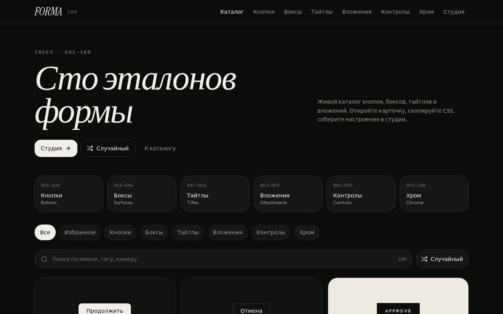
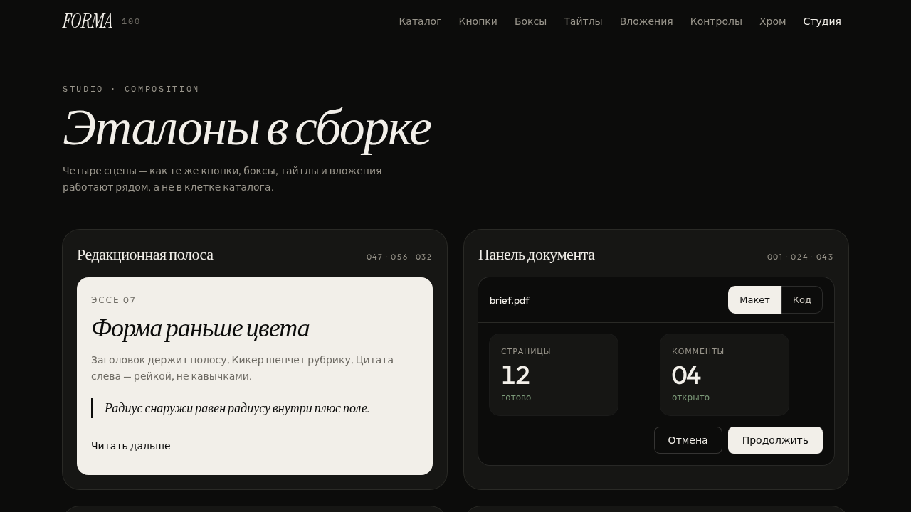
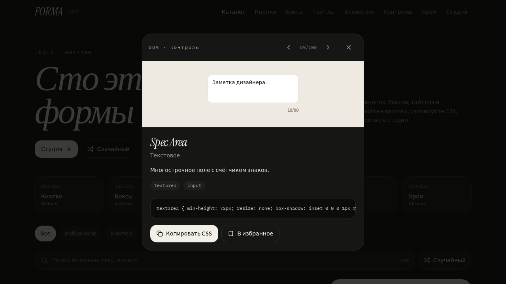

<p align="center">
  
</p>

<h1 align="center">FORMA</h1>

<p align="center">
  <strong>A museum of 100 UI specimens.</strong><br />
  Buttons, boxes, titles, attachments — live, copyable, ready to steal.<br />
  <em>Сто эталонов формы.</em>
</p>

<p align="center">
  <a href="https://github.com/god4claw/FORMA/blob/main/LICENSE"></a>
  
  
  
  
</p>

<p align="center">
  <a href="#catalog">Catalog</a> ·
  <a href="#studio">Studio</a> ·
  <a href="#getting-started">Getting started</a> ·
  <a href="#structure">Structure</a> ·
  <a href="#русский">Русский</a>
</p>

---

FORMA is a field catalog of interface form. Each specimen is a real control — not a screenshot — sitting in its own visual world. Open a card, copy the CSS, pin it, or drop it into the studio and see how it behaves next to its neighbors.

<p align="center">
  
</p>

## Catalog

One hundred units, six shelves.

| # | Shelf | Range | What you get |
| --- | --- | --- | --- |
| 01 | **Buttons** / Кнопки | 001–024 | Fill, ghost, stamp, pill, FAB, split, press |
| 02 | **Surfaces** / Боксы | 025–046 | Sheet, ticket, polaroid, window, notebook, envelope |
| 03 | **Titles** / Тайтлы | 047–062 | Italic display, drop cap, kicker, pull quote, small caps |
| 04 | **Attachments** / Вложения | 063–080 | File chip, PDF, unfurl, avatars, progress, mention |
| 05 | **Controls** / Контролы | 081–092 | Field, switch, segments, OTP, stepper, range |
| 06 | **Chrome** / Хром | 093–100 | Banner, toast, tabs, crumbs, empty, pagination |

### Worlds

Specimens are not all on the same background. Six fields keep the contrast honest:

| World | Field | Use |
| --- | --- | --- |
| `ink` | Warm black | Product chrome on dark |
| `paper` | Ivory | Editorial, print, forms |
| `mist` | Clay | Soft product, quiet depth |
| `studio` | Kraft | Analog, paper objects |
| `night` | Near-void | Terminal, toast, FAB |
| `grid` | Modular 16px | Technical, spec, index |

## Features

- **Live specimens** — every unit is interactive, not a static mock
- **Copy CSS** — the recipe sits under the note; one click to clipboard
- **Favorites** — bookmarks persist in the browser
- **Search** — name, tag, Russian label, or number (`/` focuses the field)
- **Random** — jump to one specimen when you need a starting point
- **Prev / next** — arrow through the current shelf from the detail sheet
- **Studio** — four compositions: editorial strip, document panel, attachment composer, layout settings

<p align="center">
  
</p>

<p align="center">
  
</p>

## Stack

- [React 19](https://react.dev) + [TanStack Start](https://tanstack.com/start) / Router
- [Tailwind CSS v4](https://tailwindcss.com) — tokens in `src/styles.css`
- [Radix UI](https://www.radix-ui.com) dialogs
- [Zustand](https://github.com/pmndrs/zustand) for favorites
- [Lucide](https://lucide.dev) icons
- Typefaces: [Instrument Serif](https://fonts.google.com/specimen/Instrument+Serif), [Outfit](https://fonts.google.com/specimen/Outfit), [IBM Plex Mono](https://fonts.google.com/specimen/IBM+Plex+Mono)

No accounts. No database. Favorites live in `localStorage`.

## Getting started

```bash
git clone https://github.com/god4claw/FORMA.git
cd FORMA
npm install
npm run dev
```

Then open the app and:

1. Filter a shelf, or hit **Случайный**
2. Open a specimen, copy CSS
3. Walk through **Студия** to see the same units in a layout

```bash
npm run typecheck   # tsc --noEmit
npm run build       # production bundle
npm run lint
```

## Structure

```text
src/
  routes/
    index.tsx                 Catalog
    collection.$slug.tsx      Shelf (buttons, surfaces, type, chips, controls, chrome)
    studio.tsx                Four composed scenes
  components/
    specimens/live.tsx        The 100 live units
    specimen-frame.tsx        Card in the grid
    specimen-detail.tsx       Sheet: note, tags, CSS, prev/next
    specimen-grid.tsx         Search, shuffle, grid
    layout.tsx                Shell, nav
  lib/
    specimens.ts              Catalog data (id, name, tags, CSS recipe)
    favorites.ts              Zustand + persist
  styles.css                  Theme tokens
  specimens.css               Per-unit styles
public/
  og.jpg                      Share card
  favicon.svg
```

Add a specimen by appending to `SPECIMENS` in [`src/lib/specimens.ts`](src/lib/specimens.ts), drawing it in [`src/components/specimens/live.tsx`](src/components/specimens/live.tsx), and giving it a class in [`src/specimens.css`](src/specimens.css).

## Design notes

FORMA prefers **form before color**. One accent (ivory on ink), two type families, concentric radii, hairline borders. Status color appears only on the marker — never on the whole panel.

The CSS under each card is a recipe, not a design-token dump. Steal the gesture (offset shadow, underscore, stamp) and restyle it in your own system.

## License

[MIT](LICENSE) © 2026 [god4claw](https://github.com/god4claw)

---

<a id="русский"></a>

## Русский

**FORMA** — полевой каталог из ста эталонов интерфейса.

Шесть полок: кнопки, боксы, тайтлы, вложения, контролы, хром. Каждый эталон живой: его можно нажать, скопировать CSS, положить в избранное. В **Студии** те же формы стоят уже не в клетке сетки, а в сборке — редакционная полоса, панель документа, композер вложений, настройки макета.

```bash
npm install
npm run dev
```

MIT. Берите форму, оставляйте цвет себе.
